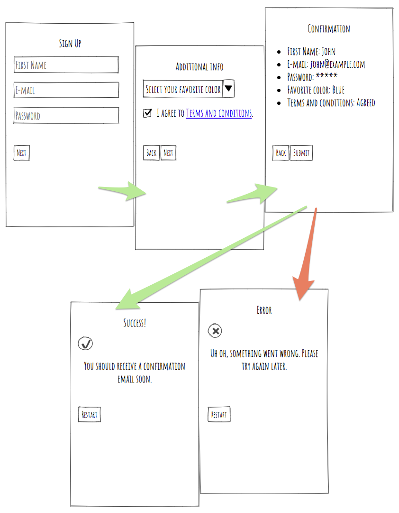

# Upgrade Challenge

## Prerequisites

- Latest [Node.js LTS](https://nodejs.org/en/download/)
- [yarn](https://yarnpkg.com/en/) or [npm](https://www.npmjs.com/)

## Goals

The review team will be evaluating your solution based on:

- Completion: The provided solution works as intended
- Code organization: How well structured is the solution
- JavaScript Knowledge: Good usage of language features in order to solve the proposed problem
- UX/UI: Consistent usage of good user experience patterns and overall attention to detail

_If you have questions regarding the challenge or feel the instructions are unclear, please reach out to your contact at Upgrade._

## Implementing your solution

This repository contains an empty project boilerplate created using [create-react-app](https://github.com/facebook/create-react-app). We ask that you please [fork](https://help.github.com/articles/fork-a-repo/) this repo and [clone](https://help.github.com/articles/cloning-a-repository/) this forked version to your local computer in order to start working on a solution.

### Quick start

```sh
# with yarn
yarn
yarn start

# with npm
npm i
npm start
```

This will install all required dependencies and start a development server.

> For more information on how to manage the development server and tooling, please consult the [create-react-app docs](https://github.com/facebook/create-react-app/blob/master/packages/react-scripts/template/README.md).

Once you're confident with your result, please submit your solution by contacting HR with a link to your working repository. Optionally, you may add a `INTRODUCTION.md` file to explain the different concepts explored within your implementation and why you decided to implement things the way they are, just keep in mind that the goal is to help guide the person that is going to be reviewing your code so try to make it clear and concise.

## Challenge

The proposed scenario aims to replicate the regular tasks our front end team might have during the development phase of a project. The goal is to be short enough in order to not be too time consuming (we recommend the candidates to try and stay within an average of 3h-6h of work in their solution) while also allowing us to assess the candidate abilities in an environment that is closer to that of day to day development.

**The challenge consists of building a multiple step form to collect basic user data.** Each step should have its own route. A confirmation page should be displayed as the last step with a submit button to post the form data. An error page should be displayed if the submission is unsuccessful.

### Routes

Your app should respond to the following 5 routes:

`/` (root) The initial step should have 3 fields: first name, email and password and a next button.

`/more-info` The second step should have 2 fields: a favorite color select field and an agreement checkbox. A back button allows going back to the initial step and a next button to the confirmation screen.

`/confirmation`: The third step is a read-only confirmation screen displaying the data collected in the 2 previous steps and a button to submit the form. A back button allows going back to to the previous step.

`/success`: Final page to be shown if the form is successfully submitted. A restart button resets the data and returns to the initial step.

`/error` An error page the user should be taken to if there are any server errors when submitting the form.

### Wireframes

The following wireframe represents how each of these pages should look and the expected flow:



### Specifications

> **Note:** _There is no need to create any API endpoints_. The endpoints you need will be accessible on `http://localhost:3001` after you invoke `npm start` or `yarn start`.

1. The list of colors to be displayed in the `/more-info` page should be built from the response to a `GET` request to `http://localhost:3001/api/colors`

2. To submit the form data, use a `POST` request with an `application/json` content type to the `http://localhost:3001/api/submit` endpoint. The submitted data should look like:

```json
{
  "name": "",
  "email": "",
  "password": "",
  "color": "",
  "terms": false
}
```

3. Show the success / error page according to the HTTP status returned from the submit request.

4. Add a loading indicator (spinner) to all API requests in order to provide UX feedback since the mocked server will have a delayed response
